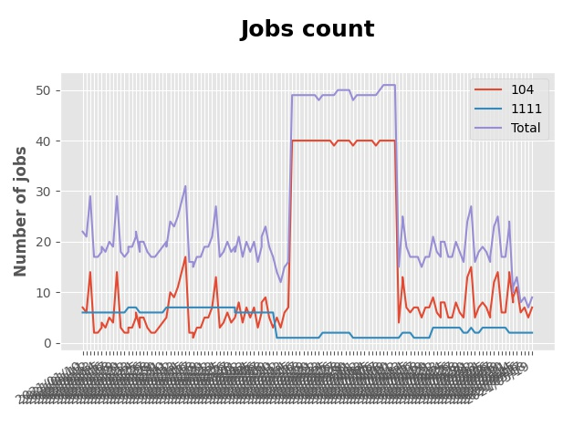

# Auto searching jobs

## Jobs include `flask` in Taiwan 

 


### Platform - 104


|    | company                                                                               | job_title                                                                                | update_time   |
|---:|:--------------------------------------------------------------------------------------|:-----------------------------------------------------------------------------------------|:--------------|
|  1 | [易勝資訊股份有限公司](https://www.104.com.tw/company/1a2x6bj8og?jobsource=jolist_a_relevance)  | [Python後端工程師(IoT物聯網)](https://www.104.com.tw/job/76vbt?jobsource=jolist_a_relevance)     | 3/04          |
|  2 | [永昕生物醫藥股份有限公司](https://www.104.com.tw/company/5xfw7xk?jobsource=2018indexpoc)         | [細胞產程開發研究員(台北)](https://www.104.com.tw/job/6ujnv?jobsource=2018indexpoc)                 | 3/05          |
|  3 | [紅門互動股份有限公司](https://www.104.com.tw/company/oh4m67k?jobsource=jolist_a_relevance)     | [Python Flask網站開發工程師(台北)](https://www.104.com.tw/job/6xtfl?jobsource=jolist_a_relevance) | 2/25          |
|  4 | [紅門互動股份有限公司](https://www.104.com.tw/company/oh4m67k?jobsource=jolist_a_relevance)     | [Python Flask網站研發工程師(台中)](https://www.104.com.tw/job/6kf9h?jobsource=jolist_a_relevance) | 2/24          |
|  5 | [美商美創資通股份有限公司台灣分公司](https://www.104.com.tw/company/1a2x6bjdsb?jobsource=2018indexpoc) | [資深Web後端工程師](https://www.104.com.tw/job/6y6f0?jobsource=2018indexpoc)                    | 3/05          |
|  6 | [美商美創資通股份有限公司台灣分公司](https://www.104.com.tw/company/1a2x6bjdsb?jobsource=2018indexpoc) | [資深後端系統工程師 (python)](https://www.104.com.tw/job/4mfzt?jobsource=2018indexpoc)            | 3/05          |
|  7 | [華碩雲端股份有限公司](https://www.104.com.tw/company/wekjlls?jobsource=2018indexpoc)           | [軟體品質工程師(SQA)](https://www.104.com.tw/job/6ubin?jobsource=2018indexpoc)                  | 3/05          |

### Platform - 1111


|    | company                                                  | job_title                                                              | update_time   |
|---:|:---------------------------------------------------------|:-----------------------------------------------------------------------|:--------------|
|  1 | [國立臺灣大學](https://www.1111.com.tw/corp/54510630/)         | [臺灣大學心理學系黃從仁老師誠徵網站前/後端全職/兼職工程師](https://www.1111.com.tw/job/92210744/) | 2021-03-02    |
|  2 | [展市華科技有限公司](https://www.1111.com.tw/corp/72520572/)      | [全端網頁工程師](https://www.1111.com.tw/job/91503317/)                       | 2021-03-03    |
|  3 | [展市華科技有限公司](https://www.1111.com.tw/corp/72520572/)      | [後端開發工程師](https://www.1111.com.tw/job/92133533/)                       | 2021-03-03    |
|  4 | [展市華科技有限公司](https://www.1111.com.tw/corp/72520572/)      | [網頁工程師](https://www.1111.com.tw/job/91605448/)                         | 2021-03-03    |
|  5 | [長青資訊股份有限公司](https://www.1111.com.tw/corp/71694811/)     | [後端工程師](https://www.1111.com.tw/job/85012186/)                         | 2021-03-03    |
|  6 | [鼎漢國際工程顧問股份有限公司](https://www.1111.com.tw/corp/51468466/) | [後端工程師](https://www.1111.com.tw/job/85884563/)                         | 2021-03-04    |

### Platform - CakeResume


|    | company                                                                               | job_title                                                                                                                           | update_time           |
|---:|:--------------------------------------------------------------------------------------|:------------------------------------------------------------------------------------------------------------------------------------|:----------------------|
|  1 | [Cathay Financial Holdings 國泰金控](https://www.cakeresume.com/companies/cathayholdings) | [數位研發專業人員-Python Software Engineer(數數發中心, DDT)](https://www.cakeresume.com/companies/cathayholdings/jobs/f5c69a)                    | Updated a day ago     |
|  2 | [Proto 新語科技有限公司](https://www.cakeresume.com/companies/proto-cx)                       | [Backend Developer (Python)](https://www.cakeresume.com/companies/proto-cx/jobs/backend-developer-python)                           | Updated 21 days ago   |
|  3 | [紅門互動股份有限公司](https://www.cakeresume.com/companies/eagleeye-5332f1)                    | [Python Flask網站開發工程師(台北)](https://www.cakeresume.com/companies/eagleeye-5332f1/jobs/python-flask-web-development-engineer-taipei)   | Updated 6 months ago  |
|  4 | [紅門互動股份有限公司](https://www.cakeresume.com/companies/eagleeye-5332f1)                    | [Python Flask網站研發工程師(台中)](https://www.cakeresume.com/companies/eagleeye-5332f1/jobs/python-flask-website-r-amp-d-engineer-taichung) | Updated 10 months ago |
|  5 | [菜蟲農食股份有限公司](https://www.cakeresume.com/companies/tsaitung)                           | [後端工程師 (初階、資深)](https://www.cakeresume.com/companies/tsaitung/jobs/back-end-engineer-initial-senior)                                | Updated 4 days ago    |
|  6 | [菜蟲農食股份有限公司](https://www.cakeresume.com/companies/tsaitung)                           | [Backend Developer (Junior & Senior)](https://www.cakeresume.com/companies/tsaitung/jobs/backend-developer-junior-senior)           | Updated 4 days ago    |
|  7 | [訊真科技股份有限公司](https://www.cakeresume.com/companies/truetel)                            | [Cloud Service 軟體工程師](https://www.cakeresume.com/companies/truetel/jobs/cloud-service-software-engineer)                            | Updated 8 months ago  |


# Getting started
## Setup Development Environment
▍Method 1 - Python Built-in venv

- Create your virtual environment
```
$ python3 -m venv venv
```
- And enable virtual environment
```
$ . venv/bin/activate
```
- Install requirements
```
$ pip install -r requirements.txt 
```

▍Method 2 - Poetry
- Install requirements
```
$ poetry install
```
- And enable virtual environment
```
$ poetry shell
```

## Setup Keyword & Run

Setup Your Keyword in [main.py](./main.py#L88)
```
if __name__ == "__main__":
    keyword = "flask"
    crawler = JobCrawler(keyword)
    crawler.run()
```

Run Crawler
```
$ python3 main.py
```

# Contributors
PRs are welcome!

This project exists thanks to all the people who contribute.

<a href="https://github.com/hsuanchi/auto-search-flask-job/graphs/contributors">
  
</a>
