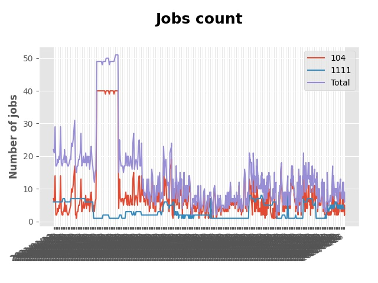

# Auto searching jobs

## Jobs include `flask` in Taiwan 

 


### Platform - 104


|    | company                                                                              | job_title                                                                                               | update_time   |
|---:|:-------------------------------------------------------------------------------------|:--------------------------------------------------------------------------------------------------------|:--------------|
|  1 | [伊諾科技有限公司](https://www.104.com.tw/company/1a2x6bkxph?jobsource=2018indexpoc)         | [(真摯徵求) Python後端工程師](https://www.104.com.tw/job/70asp?jobsource=2018indexpoc)                           | 7/01          |
|  2 | [大數據股份有限公司](https://www.104.com.tw/company/1a2x6bjjhc?jobsource=2018indexpoc)        | [分析研發工程師: AI, Deep Learning, Machine Learning](https://www.104.com.tw/job/54ffa?jobsource=2018indexpoc) | 7/01          |
|  3 | [好好證券股份有限公司](https://www.104.com.tw/company/1a2x6bjpjb?jobsource=2018indexpoc)       | [Backend Engineer(需熟Python、RESTful API )](https://www.104.com.tw/job/5572i?jobsource=2018indexpoc)      | 7/01          |
|  4 | [富萱科技股份有限公司](https://www.104.com.tw/company/1a2x6bkf9i?jobsource=jolist_b_relevance) | [Back End 研發工程師](https://www.104.com.tw/job/7ambq?jobsource=jolist_b_relevance)                         | 6/23          |
|  5 | [易勝資訊股份有限公司](https://www.104.com.tw/company/1a2x6bj8og?jobsource=2018indexpoc)       | [Python後端開發工程師(DevOps整合平台)](https://www.104.com.tw/job/7asvo?jobsource=2018indexpoc)                    | 7/01          |
|  6 | [易勝資訊股份有限公司](https://www.104.com.tw/company/1a2x6bj8og?jobsource=jolist_b_relevance) | [Python後端開發工程師(DevOps整合平台)](https://www.104.com.tw/job/7asvo?jobsource=jolist_b_relevance)              | 7/01          |
|  7 | [米約科技有限公司](https://www.104.com.tw/company/1a2x6bl97m?jobsource=2018indexpoc)         | [Python工程師](https://www.104.com.tw/job/6zey2?jobsource=2018indexpoc)                                    | 7/01          |
|  8 | [紅門互動股份有限公司](https://www.104.com.tw/company/oh4m67k?jobsource=jolist_b_relevance)    | [Python Flask網站開發工程師(台北)](https://www.104.com.tw/job/6xtfl?jobsource=jolist_b_relevance)                | 6/28          |
|  9 | [紅門互動股份有限公司](https://www.104.com.tw/company/oh4m67k?jobsource=jolist_b_relevance)    | [Python Flask網站研發工程師(台中)](https://www.104.com.tw/job/6kf9h?jobsource=jolist_b_relevance)                | 6/28          |
| 10 | [艾酷互動股份有限公司](https://www.104.com.tw/company/1a2x6bkq17?jobsource=2018indexpoc)       | [數據⼯程師](https://www.104.com.tw/job/7275w?jobsource=2018indexpoc)                                        | 7/01          |
| 11 | [華翰物產實業股份有限公司](https://www.104.com.tw/company/10xb8hsw?jobsource=2018indexpoc)       | [資深資料科學家(Senior Data Scientist)](https://www.104.com.tw/job/72vx2?jobsource=2018indexpoc)               | 7/01          |
| 12 | [萊鎂醫療器材股份有限公司](https://www.104.com.tw/company/bkgh1dc?jobsource=jolist_b_relevance)  | [雲端應用工程師](https://www.104.com.tw/job/791cq?jobsource=jolist_b_relevance)                                | 6/30          |
| 13 | [長佳智能股份有限公司](https://www.104.com.tw/company/1a2x6bkoxb?jobsource=jolist_b_relevance) | [後端工程師](https://www.104.com.tw/job/6qa54?jobsource=jolist_b_relevance)                                  | 6/30          |

### Platform - 1111


|    | company                                              | job_title                                          | update_time   |
|---:|:-----------------------------------------------------|:---------------------------------------------------|:--------------|
|  1 | [億力資訊股份有限公司](https://www.1111.com.tw/corp/54937860/) | [python工程師](https://www.1111.com.tw/job/97374762/) | 2021-06-28    |
|  2 | [長青資訊股份有限公司](https://www.1111.com.tw/corp/71694811/) | [後端工程師](https://www.1111.com.tw/job/85012186/)     | 2021-07-01    |


# Getting started
## Setup Development Environment
▍Method 1 - Python Built-in venv

- Create your virtual environment
```
$ python3 -m venv venv
```
- And enable virtual environment
```
$ . venv/bin/activate
```
- Install requirements
```
$ pip install -r requirements.txt 
```

▍Method 2 - Poetry
- Install requirements
```
$ poetry install
```
- And enable virtual environment
```
$ poetry shell
```

## Setup Keyword & Run

Setup Your Keyword in [main.py](./main.py#L88)
```
if __name__ == "__main__":
    keyword = "flask"
    crawler = JobCrawler(keyword)
    crawler.run()
```

Run Crawler
```
$ python3 main.py
```

# Contributors
PRs are welcome!

This project exists thanks to all the people who contribute.

<a href="https://github.com/hsuanchi/auto-search-flask-job/graphs/contributors">
  
</a>
